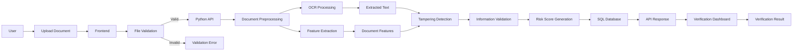

 # 🛡️ AI-Based Fake Identity & Document Screening System
 

 SURAKSHA is an intelligent **AI-powered identity and document screening platform** designed to detect forged, manipulated, or suspicious identity credentials and official documents.

 The system combines **OCR, image analysis, anomaly detection, risk scoring, API-based verification, and SQL-backed record management** into a unified screening platform.


 ## 🎯 Problem Statement

 Identity documents such as **ID cards, passports, certificates, and other official credentials** can be manipulated using sophisticated image-editing and document-forgery techniques.

 Manual verification can be:

 - ⏳ Time-consuming
- 👨‍💼 Dependent on human expertise
- ❌ Vulnerable to subtle visual manipulation
- 📄 Difficult to scale for large numbers of documents

 ### 💡 Our Solution

 We propose an intelligent automated screening system that analyzes uploaded documents and generates a **risk assessment** based on multiple indicators.

 The system aims to identify:

 - Forged or suspicious fonts
- Altered text fields
- Pixel-level inconsistencies
- Image manipulation
- Suspicious document structures
- OCR inconsistencies
- Anomalies in extracted information
- Potentially invalid or manipulated credentials

---

 # 🚀 Key Features

 ### 🔍 1. OCR-Based Document Analysis

 Extract textual information from uploaded documents using OCR technology.

 **Example extracted fields:**

```
Name
Date of Birth
Document Number
Address
Issue Date
Expiry Date
Certificate Number
```

---

 ### 🧠 2. AI-Based Tampering Detection

 The system analyzes the uploaded document for potential manipulation using image and numerical features.

 Possible indicators include:

 - Pixel inconsistencies
- Unusual compression artifacts
- Font inconsistencies
- Misaligned text
- Suspicious regions
- Altered backgrounds
- Unexpected image patterns

---

 ### 📊 3. Automated Risk Scoring

 Each document receives a risk score based on the detected anomalies.

 Example:

```
┌─────────────────────────────┐
│       DOCUMENT RESULT       │
├─────────────────────────────┤
│ Risk Score : 82 / 100       │
│ Status     : ⚠️ SUSPICIOUS │
├─────────────────────────────┤
│ Font Check       : ⚠️       │
│ Pixel Analysis   : ❌       │
│ OCR Consistency  : ⚠️       │
│ Data Validation  : ✅       │
└─────────────────────────────┘
```

 > **Note:** The risk score is intended as a screening/decision-support signal and should not by itself be treated as definitive proof that a document is fraudulent.

---

 ### 🔐 4. Secure Verification API

 The backend exposes APIs that allow the frontend to communicate with the document analysis engine.

 The API can handle:

 - Document uploads
- OCR processing
- Feature extraction
- Risk calculation
- Verification requests
- Result retrieval

---

 ### 🗄️ 5. SQL Database

 A SQL database is used for structured storage of application records such as:

 - Document metadata
- Verification requests
- OCR results
- Risk scores
- Analysis results
- Verification status
- Audit information

 Sensitive data should be protected using appropriate access controls, encryption, retention policies, and secure handling practices.

---

 # 🏗️ System Architecture

```
                    ┌────────────────────────┐
                    │       USER / OFFICER    │
                    └────────────┬───────────┘
                                 │
                                 ▼
                    ┌────────────────────────┐
                    │      WEB FRONTEND      │
                    │                        │
                    │ HTML + CSS + JavaScript │
                    └────────────┬───────────┘
                                 │
                            HTTP / REST
                                 │
                                 ▼
                    ┌────────────────────────┐
                    │       PYTHON API       │
                    │                        │
                    │ Document Processing    │
                    │ OCR Processing         │
                    │ Feature Extraction     │
                    │ Risk Assessment        │
                    └────────────┬───────────┘
                                 │
                  ┌──────────────┼──────────────┐
                  │              │              │
                  ▼              ▼              ▼
           ┌────────────┐ ┌────────────┐ ┌──────────────┐
           │ OCR Engine │ │ AI / Image │ │ Verification │
           │            │ │ Analysis   │ │ Engine       │
           └────────────┘ └────────────┘ └──────────────┘
                  │              │              │
                  └──────────────┼──────────────┘
                                 ▼
                    ┌────────────────────────┐
                    │       SQL DATABASE     │
                    │                        │
                    │ Results / Metadata     │
                    │ Verification Records   │
                    └────────────────────────┘
```

---

 # 🔄 Complete Workflow

 The overall document verification process follows these stages:

 1. User uploads an identity document.
2. Frontend validates the file.
3. Document is sent to the Python backend through an API.
4. Backend preprocesses the document.
5. OCR extracts the document's textual information.
6. Image/document features are calculated.
7. Tampering and anomaly detection is performed.
8. Extracted information is validated.
9. A risk score is generated.
10. The result is stored in the SQL database.
11. The API sends the analysis result back to the frontend.
12. The dashboard displays the verification result.

---

 # 📌REPRESENTAION of Workflow

---
## Document Verification Workflow




 # 🛠️ Technology Stack

 ## 🎨 Frontend

 The frontend provides an interactive dashboard for uploading documents and viewing verification results.

 | Technology | Purpose |
| --- | --- |
| **HTML5** | Page structure |
| **CSS3** | Styling and responsive UI |
| **JavaScript** | Client-side logic and API communication |
| **Fetch API** | Communication with backend APIs |

### Frontend Responsibilities

```
Document Upload
      ↓
File Validation
      ↓
API Request
      ↓
Loading / Processing State
      ↓
Receive JSON Response
      ↓
Display Risk Score
      ↓
Display Anomaly Report
```

---

 # 🐍 Backend

 The backend is developed using **Python**.

 It acts as the central processing layer between the frontend, AI/document-analysis components, and database.

 ### Main Responsibilities

 - REST API handling
- Document processing
- OCR integration
- Numerical feature processing
- Image analysis
- Risk-score calculation
- Database communication
- Verification result generation

 ### Core Python Package

 **NumPy** is used for numerical operations and processing of arrays/features generated during document analysis.

 Example:

```
import numpy as np

def calculate_risk(features):
    features = np.asarray(features)

    risk_score = np.mean(features)

    return float(risk_score)
```

 > The final production scoring model should be calibrated and validated against an appropriate, representative dataset rather than relying on a simple average alone.

---

 # 🔌 API Layer

 The Python backend exposes APIs for communication with the frontend.

 ### Example API Structure

 | Method | Endpoint | Purpose |
| --- | --- | --- |
| `POST` | `/api/upload` | Upload document |
| `POST` | `/api/analyze` | Analyze document |
| `POST` | `/api/verify` | Verify document |
| `GET` | `/api/result/<id>` | Retrieve analysis result |
| `GET` | `/api/health` | Check backend status |

### Example Request

```
POST /api/analyze
Content-Type: multipart/form-data
```

 ### Example Response

```
{
  "document_id": "DOC-1001",
  "status": "suspicious",
  "risk_score": 82,
  "checks": {
    "ocr": "passed",
    "font_analysis": "warning",
    "pixel_analysis": "failed",
    "data_validation": "passed"
  }
}
```

---

 # 🗄️ Database

 The application uses an **SQL database** for structured storage.

 A possible database design is:

```
┌─────────────────────┐
│      DOCUMENTS      │
├─────────────────────┤
│ document_id         │
│ document_type       │
│ uploaded_at         │
│ file_reference      │
└──────────┬──────────┘
           │
           ▼
┌─────────────────────┐
│   VERIFICATION      │
├─────────────────────┤
│ verification_id     │
│ document_id         │
│ risk_score          │
│ status              │
│ verified_at         │
└──────────┬──────────┘
           │
           ▼
┌─────────────────────┐
│    ANALYSIS_LOG     │
├─────────────────────┤
│ analysis_id         │
│ verification_id     │
│ ocr_result          │
│ anomaly_result      │
│ pixel_result        │
│ font_result         │
└─────────────────────┘
```

---

 # 📁 Suggested Project Structure

```
SIH-Fake-Identity-Detection/
│
├── frontend/
│   ├── index.html
│   ├── dashboard.html
│   │
│   ├── css/
│   │   ├── style.css
│   │   └── dashboard.css
│   │
│   └── js/
│       ├── app.js
│       ├── upload.js
│       └── dashboard.js
│
├── backend/
│   ├── app.py
│   ├── api/
│   │   ├── routes.py
│   │   └── verification.py
│   │
│   ├── models/
│   │   └── document_model.py
│   │
│   ├── services/
│   │   ├── ocr_service.py
│   │   ├── image_analysis.py
│   │   └── risk_engine.py
│   │
│   └── utils/
│       └── preprocessing.py
│
├── database/
│   ├── schema.sql
│   └── seed.sql
│
├── uploads/
│   └── .gitkeep
│
├── requirements.txt
├── .gitignore
└── README.md
```

---

 # 🔄 Data Flow

```
sequenceDiagram

    actor User
    participant FE as Frontend
    participant API as Python API
    participant OCR as OCR Engine
    participant AI as Analysis Engine
    participant DB as SQL Database

    User->>FE: Upload Document
    FE->>FE: Validate File
    FE->>API: POST /api/analyze

    API->>API: Preprocess Document

    API->>OCR: Extract Text
    OCR-->>API: OCR Result

    API->>AI: Analyze Image & Features
    AI-->>API: Anomaly Indicators

    API->>API: Calculate Risk Score

    API->>DB: Store Verification Result
    DB-->>API: Record ID

    API-->>FE: JSON Result
    FE-->>User: Display Dashboard
```

---

 # 📊 Risk Assessment Pipeline

 Mermaid flowchart: 📄 Document, 🔤 OCR, 🖼️ Image Analysis, 🔡 Font Analysis, 📐 Layout Analysis, Feature Processing, 🧠 Anomaly Detection, 📊 Risk Score, Risk Level, 🟢 Low, 🟡 Medium, 🔴 High

The exact thresholds should be treated as configurable and validated experimentally rather than assumed to be universally correct.

---

 # 🎨 Dashboard Concept

 The proposed dashboard focuses on quick interpretation by authorized users.

```
╔══════════════════════════════════════════════════════╗
║              🛡️ DOCUMENT SCREENING SYSTEM             ║
╠══════════════════════════════════════════════════════╣
║                                                      ║
║  📄 Document          🆔 DOC-1001                    ║
║  Type                 Passport                       ║
║                                                      ║
║  ┌────────────────────────────────────────────────┐  ║
║  │              RISK SCORE                        │  ║
║  │                 82 / 100                       │  ║
║  │          🔴 HIGH RISK / REVIEW                 │  ║
║  └────────────────────────────────────────────────┘  ║
║                                                      ║
║  OCR Analysis             ✅ Passed                  ║
║  Font Consistency         ⚠️ Warning                 ║
║  Pixel Analysis           ❌ Anomaly                 ║
║  Data Validation          ✅ Passed                  ║
║                                                      ║
║             [ View Detailed Report ]                 ║
╚══════════════════════════════════════════════════════╝
```

---

 # ⚙️ Installation & Setup

 ## 1️⃣ Clone the Repository

```
git clone <YOUR_REPOSITORY_URL>
cd SIH-Fake-Identity-Detection
```

 ## 2️⃣ Create a Python Virtual Environment

```
python -m venv venv
```

 ### Windows

```
venv\Scripts\activate
```

 ### Linux / macOS

```
source venv/bin/activate
```

---

 ## 3️⃣ Install Python Dependencies

```
pip install -r requirements.txt
```

 Example `requirements.txt`:

```
numpy
```

 Add the actual framework and OCR/database dependencies used by your implementation to this file.

---

 ## 4️⃣ Configure Database

 Create the SQL database and execute:

```
database/schema.sql
```

 Configure the database connection using environment variables rather than committing credentials to the repository.

 Example:

```
DB_HOST=localhost
DB_PORT=3306
DB_NAME=document_verification
DB_USER=your_user
DB_PASSWORD=your_password
```

---

 ## 5️⃣ Start the Backend

 Example:

```
python backend/app.py
```

 The API can then be accessed through the configured backend host and port.

---

 ## 6️⃣ Start the Frontend

 Open:

```
frontend/index.html
```

 or serve the frontend using a local development server.

---

 # 🔐 Security Considerations

 Because this system deals with identity documents, security and privacy are fundamental requirements.

 The production system should implement:

 - 🔒 HTTPS/TLS
- 🔑 Strong authentication
- 👮 Role-based access control
- 🛡️ Secure API authentication
- 🔐 Encryption at rest and in transit
- 🧹 Controlled document retention/deletion
- 📝 Audit logging
- 🚫 Strict upload validation
- 📦 File-type and size restrictions
- 🧪 Malware/security scanning for uploaded files
- 🔒 Secrets stored outside source code
- 🕵️ Access logging for sensitive operations

 The system should also minimize unnecessary storage of personally identifiable information (PII).

---

 # 🌐 Future Enhancements

 The project can be extended with:

 ### ⛓️ Blockchain-Based Verification

 Store cryptographic hashes or verification records on a blockchain or permissioned ledger to provide tamper-evident verification.

 Mermaid flowchart: Official Document, Generate Hash, Blockchain / Permissioned Ledger, Submitted Document, Generate Hash, Compare Hash, Hash Verification, 🟢 Integrity Verified, 🔴 Integrity Difference Detected

### 🤖 Advanced AI Models

 Future versions can incorporate:

 - CNN-based image analysis
- Vision Transformers
- Document-layout models
- Deep-learning OCR
- Forgery localization
- Synthetic document detection
- Multimodal document verification

 ### 🔗 Secure Database/API Integration

 The platform can potentially integrate with authorized verification databases or cryptographic validation systems where appropriate and legally permitted.

---

 # 📈 Expected Impact

 The proposed system aims to assist authorized personnel by providing:

 - ⚡ Faster preliminary document screening
- 🔎 Automated anomaly identification
- 📊 Consistent risk indicators
- 🧾 Structured verification records
- 🖥️ Centralized monitoring dashboard
- 🔐 Improved digital document security
- 👮 Decision-support for authorized verification workflows

 The system is designed as an **assistance and screening tool**, with final verification decisions remaining with authorized personnel and applicable official procedures.

---

 # 🧪 Testing Strategy

 Testing should cover multiple layers:

```
                    TESTING
                       │
          ┌────────────┼────────────┐
          ▼            ▼            ▼
      Frontend       Backend      Database
          │            │            │
       UI Tests      API Tests    SQL Tests
          │            │            │
          └────────────┼────────────┘
                       ▼
                Integration Tests
                       │
                       ▼
                Security Testing
                       │
                       ▼
               Performance Testing
```

 Important test cases include:

 - Valid document
- Blurred document
- Rotated document
- Low-resolution document
- Altered text
- Changed font
- Modified image region
- Missing fields
- Invalid file type
- Oversized upload
- API failure
- Database failure

---

 # 👥 Team Responsibilities

 A possible team division:

 | Role | Responsibility |
| --- | --- |
| 🎨 Frontend Developer | HTML, CSS, JavaScript, dashboard |
| 🐍 Backend Developer | Python API and business logic |
| 🤖 AI/ML Developer | OCR, image analysis, anomaly detection |
| 🗄️ Database Developer | SQL schema and database integration |
| 🔐 Security Developer | Authentication, authorization, secure APIs |
| 📊 Integration Developer | Frontend–backend–database integration |

---

 # 📜 Disclaimer

 This project is developed as a **Smart India Hackathon prototype** for automated document screening and cybersecurity research.

 A system-generated risk score or anomaly flag should **not by itself be treated as conclusive proof of fraud or identity status**. Real-world deployment should use validated models, authorized data sources, appropriate human review, privacy protections, and applicable legal and operational procedures.

---

 # ⭐ Project Vision

 > **"Detect suspicious documents faster. Assist verification smarter. Protect identity digitally."**

 The long-term vision is to build a secure, scalable and intelligent platform that helps authorized organizations identify potential document manipulation while maintaining **security, privacy, transparency, and human oversight**.

---

 🛡️  **HAPPY CODING**
